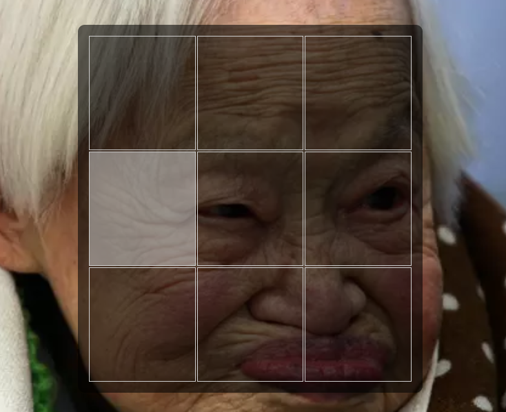

# Hash
Jogo da velha

  <a href="#tecnologias">Tecnologias</a>&nbsp;&nbsp;&nbsp;|&nbsp;&nbsp;&nbsp;
  <a href="#projeto">Projeto</a>&nbsp; | &nbsp;&nbsp;&nbsp;
  <a href="#telas">Tela</a>

 

---

## Tecnologias

Esse projeto foi desenvolvido com as seguintes tecnologias:

---

## Projeto

Aplicando CSS e Lógicas de Javascript desenvolvi um jogo da velha

---

## Tela

 

